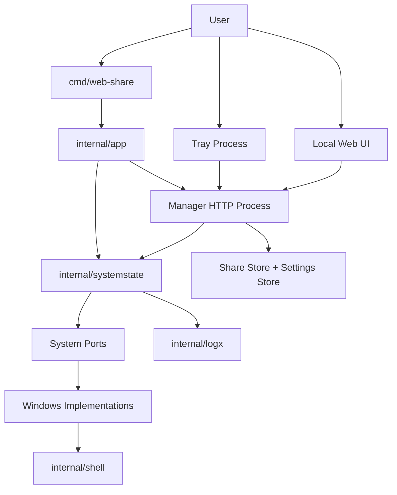
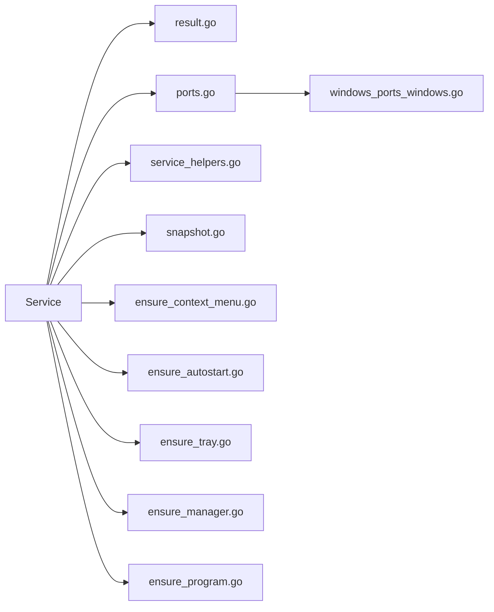
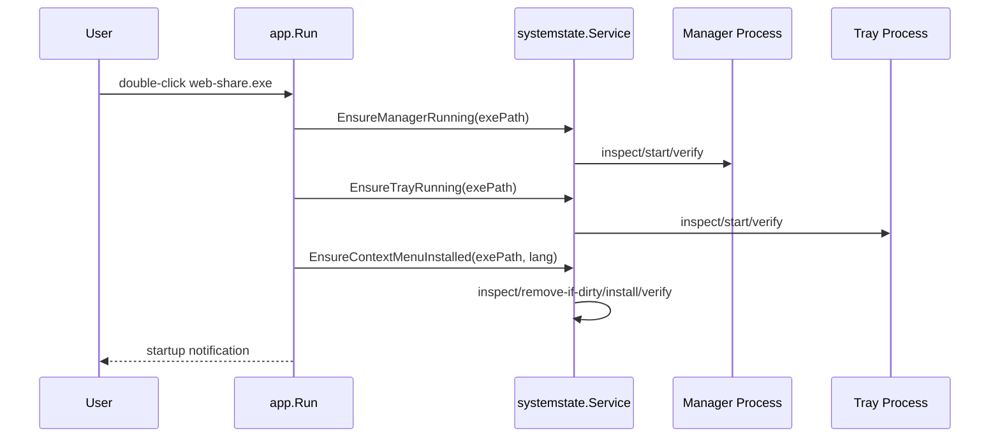
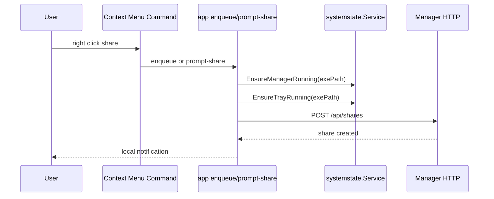
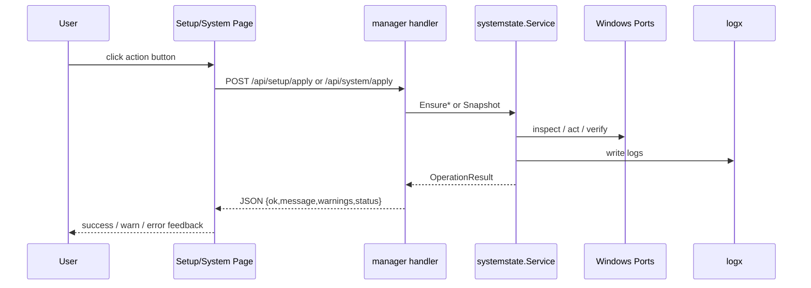
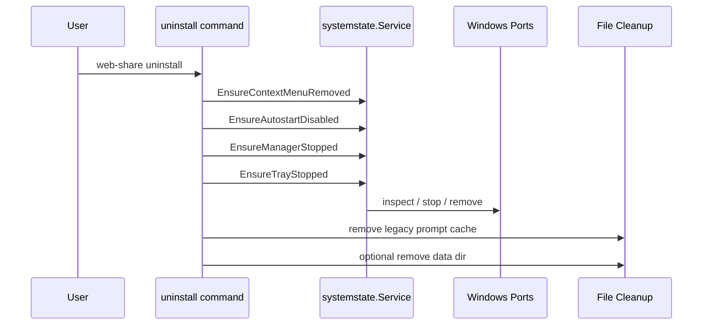

# 系统结构与文档对齐说明

## 目的

本文档基于当前代码状态，对照现有文档，说明哪些内容已经需要同步更新，并给出当前版本的系统结构图和关键流程图。

本文关注的是当前代码已经实际实现的结构，而不是未来规划。

## 一、现有文档需要对齐的点

## 1. `README.md`

当前 `README.md` 的用户行为说明大体仍然成立，但有几处已经落后于代码结构：

- 文档还主要从“功能和用户行为”角度描述系统，没有说明当前已经引入了 `internal/systemstate` 作为系统状态编排层。
- 文档没有说明当前系统集成操作已经逐步改成“目标状态驱动”的实现方式。
- 文档没有说明日志系统已经存在，日志写入路径为：
  - `web-share.log` in the executable directory, with rotated backups `web-share.log.1` to `web-share.log.5`
- 文档没有说明 `setup` 和 `system settings` 页面现在已经支持 `success / warning / error` 三态反馈。
- 文档没有说明右键菜单、自启动、托盘、manager 的启动/停止已经主要通过统一编排层处理，而不是入口各自维护一套状态判断。

建议补充：

- 一段“内部架构简述”
- 一段“日志与本地反馈”
- 一段“系统设置页的 warning 语义”

## 2. `docs/usage.md`

`docs/usage.md` 的用户路径说明仍然可用，但缺少以下内容：

- 安装、卸载、启动、停止这些行为在实现上已经趋向幂等化。
- 如果目标已处于期望状态，前端/CLI 不一定报错，而可能给出 warning 或“already in target state”。
- 系统设置页和 setup 页的异步操作现在会返回 warning，而不是只有成功/失败。
- `stop_program` 不再只是一个“可能断连接”的动作，后端已经改成先返回确认响应，再延迟进入停止流程。

建议补充：

- “系统状态操作是目标态驱动”
- “设置页会显示 warning”
- “操作日志可用于排查无感失败”

## 3. `docs/system-behavior.md`

这是当前最需要同步的文档。

目前它描述了用户可见行为，但还没有跟上内部结构变化：

- 没有体现 `internal/systemstate` 这层系统状态编排骨架
- 没有体现 `internal/logx` 日志模块
- 没有体现 `setup/system` 页的 warning 反馈能力
- 没有体现 manager / tray / context menu / autostart 的状态检查与收敛已经主要统一到同一层
- 没有体现当前“状态读取”也开始通过统一 `Snapshot(...)` 汇总，而不是全部散落在 handler 中

建议这里补一个新的章节：

- “内部系统状态编排”
- “日志与反馈通道”
- “系统状态目标与收敛规则”

## 4. `docs/problem-notes.md`

这份文档里仍然保留了大量 `prompt-share.vbs` 的历史记录，这本身没有问题，但需要明确它是“历史问题记录”，而不是当前实现描述。

建议补一条状态说明：

- 当前右键菜单密码分享已切到程序内原生 Windows 密码输入框
- `prompt-share.vbs` 仅作为旧残留兼容/清理对象存在

## 二、当前代码下的系统结构

## 1. 分层说明

当前代码大体可以分成四层：

### 入口层

负责接收命令、HTTP 请求、托盘点击和页面动作。

主要文件：

- [main.go](C:/Users/zhjun/Desktop/code/web-share/cmd/web-share/main.go)
- [app.go](C:/Users/zhjun/Desktop/code/web-share/internal/app/app.go)
- [manager.go](C:/Users/zhjun/Desktop/code/web-share/internal/manager/manager.go)
- [tray_windows.go](C:/Users/zhjun/Desktop/code/web-share/internal/tray/tray_windows.go)

### 骨架编排层

负责系统状态检查、目标态收敛、warning/error 聚合。

主要目录：

- [internal/systemstate](C:/Users/zhjun/Desktop/code/web-share/internal/systemstate)

这一层是当前“系统骨架”：

- 定义端口接口
- 定义结果结构
- 定义 `Ensure*`
- 定义 `Snapshot`

### 平台实现层

负责具体的 Windows 行为实现。

主要文件：

- [windows_ports_windows.go](C:/Users/zhjun/Desktop/code/web-share/internal/systemstate/windows_ports_windows.go)
- [context_menu_windows.go](C:/Users/zhjun/Desktop/code/web-share/internal/shell/context_menu_windows.go)
- [process_windows.go](C:/Users/zhjun/Desktop/code/web-share/internal/shell/process_windows.go)
- [password_prompt_windows.go](C:/Users/zhjun/Desktop/code/web-share/internal/shell/password_prompt_windows.go)

### 业务层

负责分享管理、页面逻辑、上传下载、数据存储。

主要目录：

- [internal/manager](C:/Users/zhjun/Desktop/code/web-share/internal/manager)
- [internal/clipboard](C:/Users/zhjun/Desktop/code/web-share/internal/clipboard)
- [internal/server](C:/Users/zhjun/Desktop/code/web-share/internal/server)

## 2. 当前系统结构图

## 3. 当前 `systemstate` 内部结构图

## 三、关键流程图

## 1. 双击启动流程

这是当前 `web-share.exe` 无参数启动的主路径。

## 2. 右键分享流程

## 3. 系统设置页动作流程

## 4. 卸载流程

## 四、当前代码与文档语义的差异总结

可以把差异概括成三类：

### 1. 行为文档还停留在“用户功能描述”

但代码已经进入“系统状态编排 + 结构/实现分层”阶段。

### 2. 文档还没体现 warning 与日志

现在代码已经支持：

- warning 返回
- 本地日志
- setup/system 页面三态提示

### 3. 文档还没体现骨架层

现在真正负责系统集成流程编排的是：

- [internal/systemstate](C:/Users/zhjun/Desktop/code/web-share/internal/systemstate)

这部分应该在架构文档中被明确写出来。

## 五、建议的文档更新顺序

建议按以下顺序同步：

1. 先更新 [system-behavior.md](C:/Users/zhjun/Desktop/code/web-share/docs/system-behavior.md)
   - 补内部结构、日志、warning 语义
2. 再更新 [README.md](C:/Users/zhjun/Desktop/code/web-share/README.md)
   - 补日志路径、系统设置页 warning、状态驱动语义
3. 最后更新 [usage.md](C:/Users/zhjun/Desktop/code/web-share/docs/usage.md)
   - 补用户可感知变化，不必写太多内部实现细节

## 六、当前建议

从代码状态看，最适合作为“架构入口说明”的文档就是本文。

后续如果需要，可以把本文压缩后同步到：

- `README.md` 的简版架构段
- `docs/system-behavior.md` 的详细版架构段
